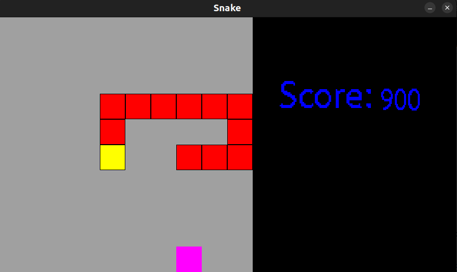

# Snake

This is classic game made with FASM and SDL2.

Run `make bar` to build and run the game.

Program was written with FASM under x86-64 processor on Linux.

Also library SDL2 (+SDL2_TTF) was used. Make sure you have it to compile properly.
